# My Playable Resume
My resume - but in a game!

Live Link: [Playable Resume!](https://baelul.github.io/playable-resume/)

### Preview
##### Title Page  
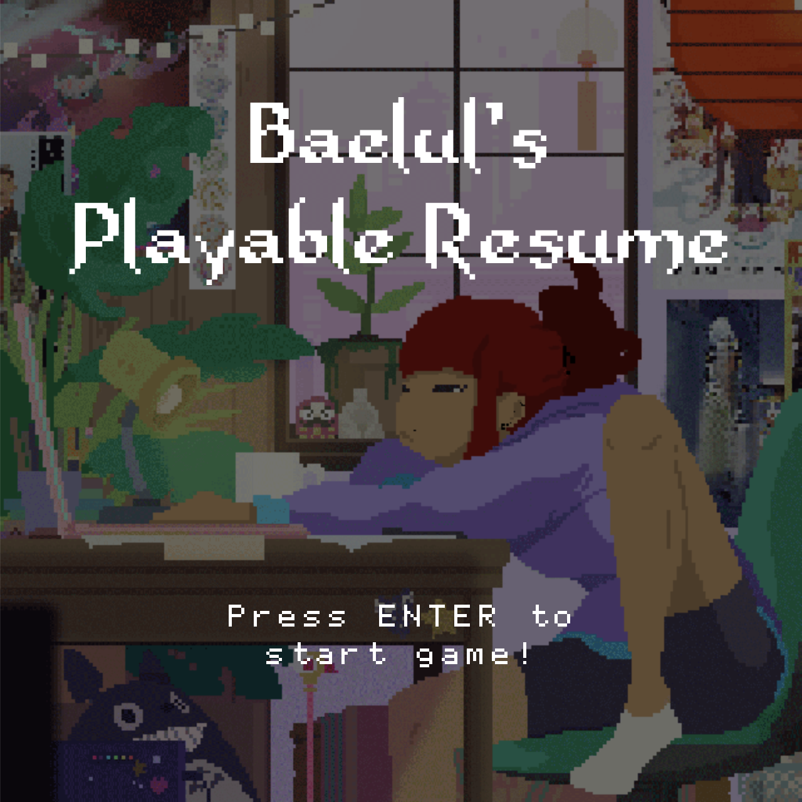 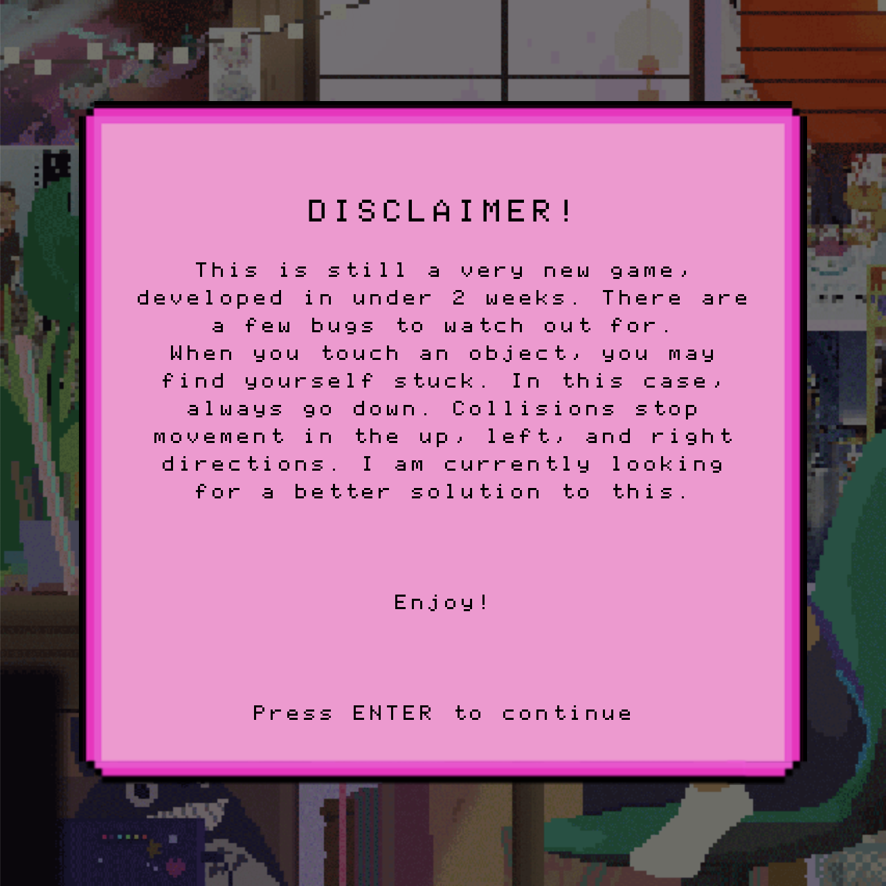 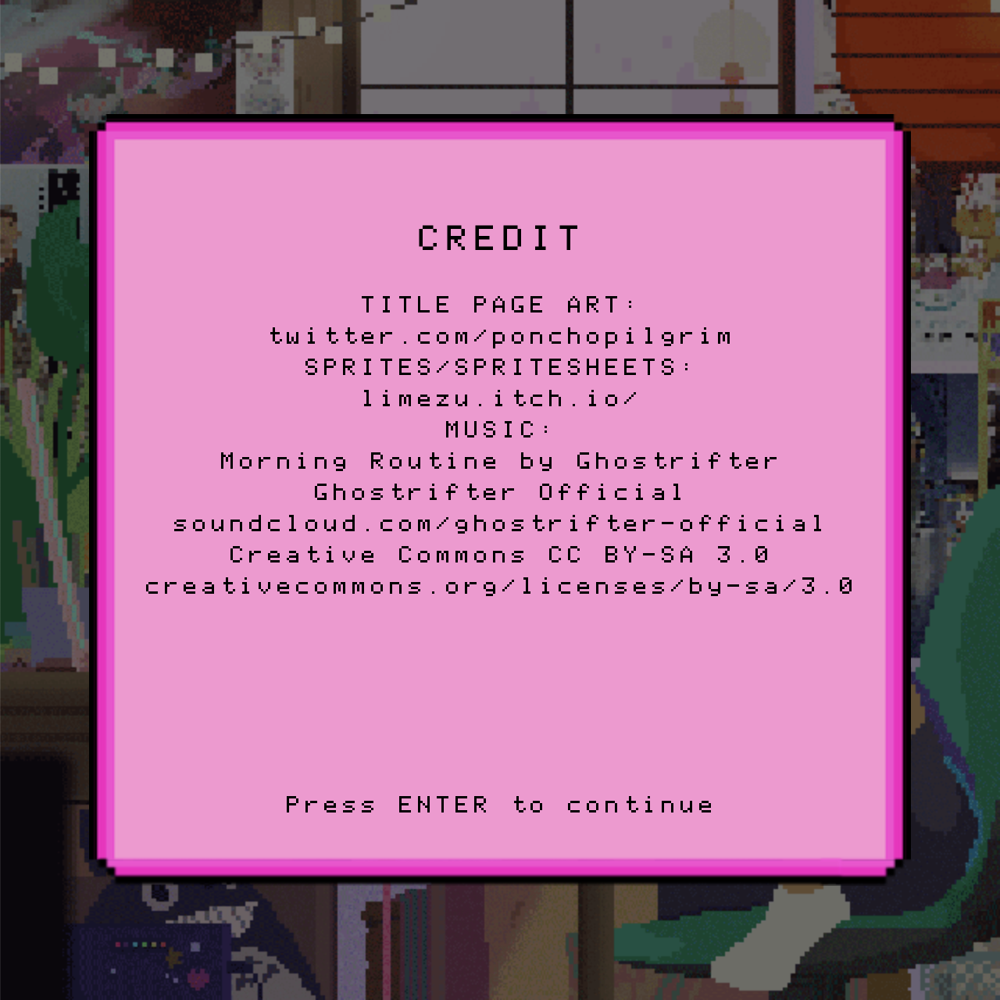

##### Levels  
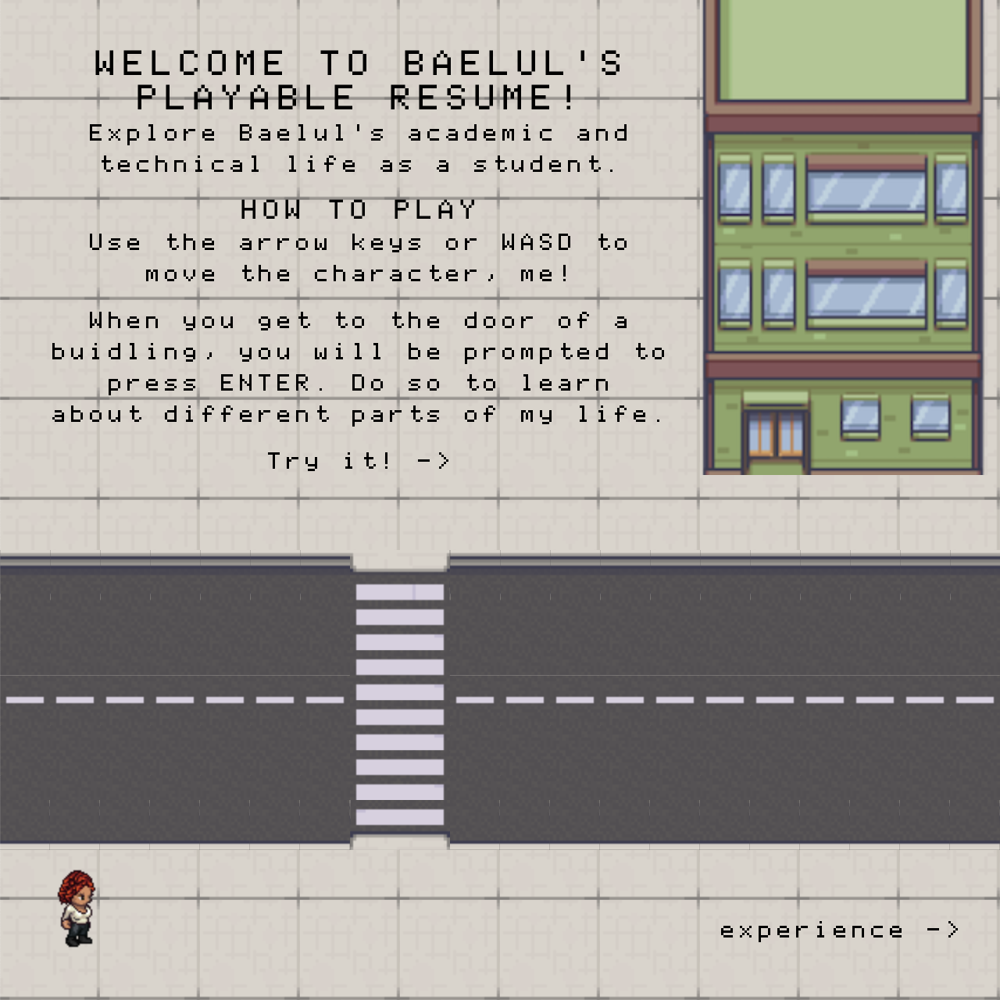 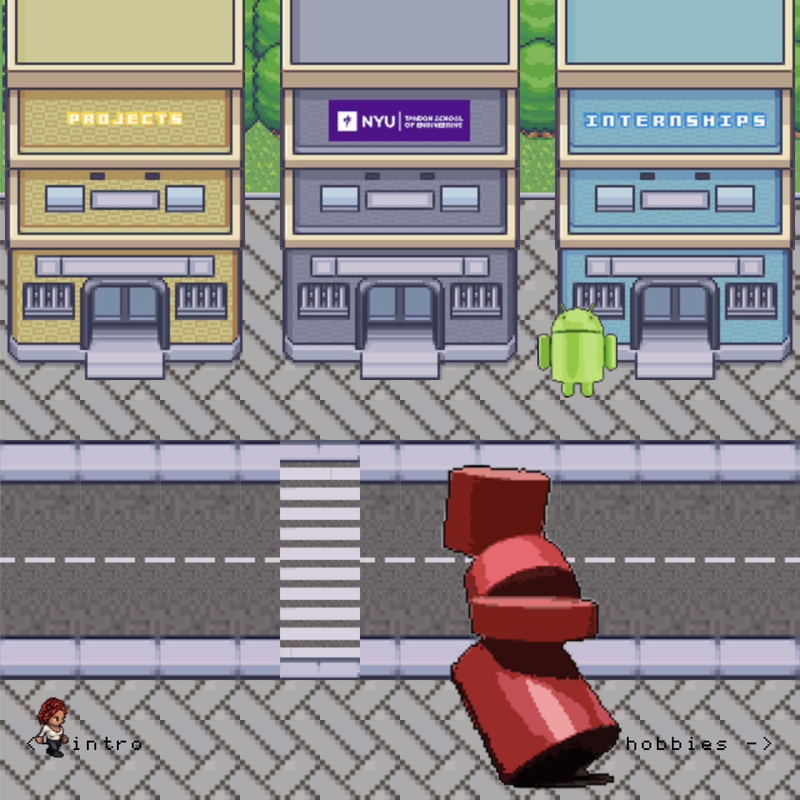 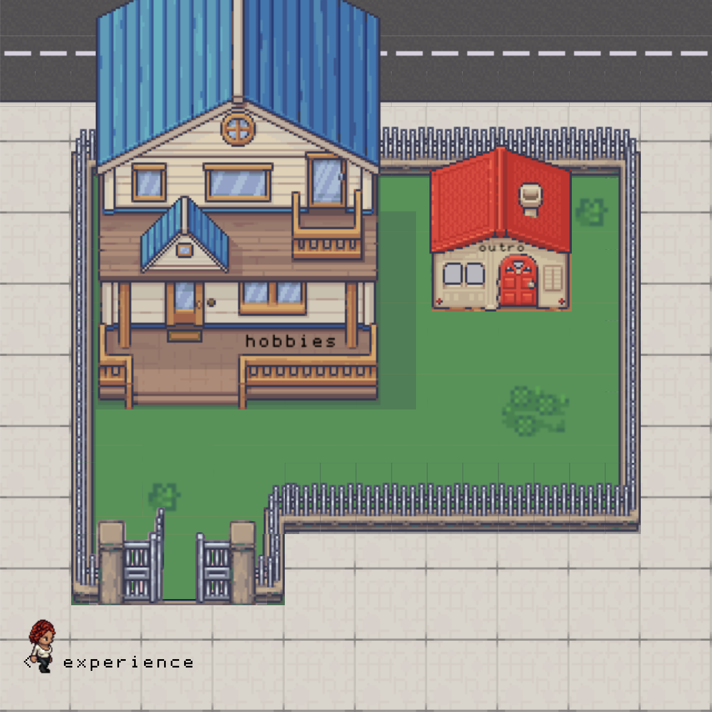

##### Gameplay  
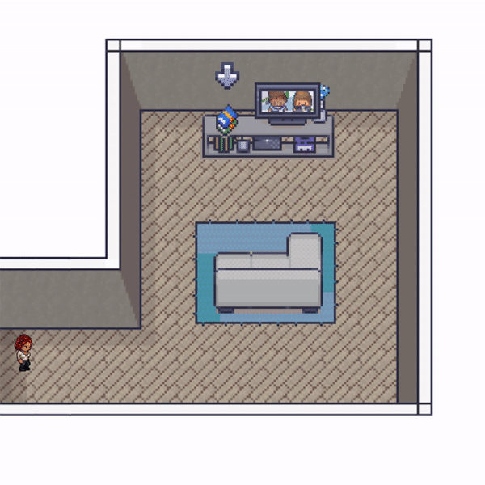  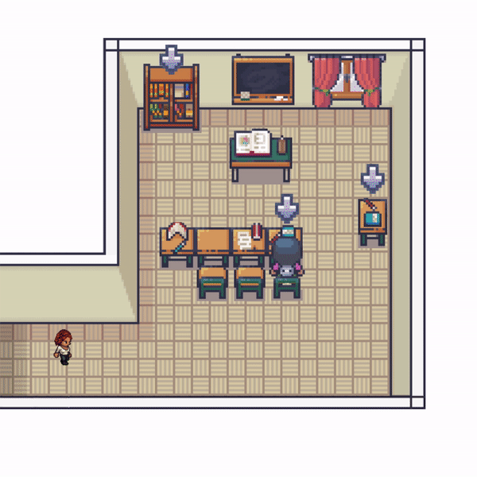 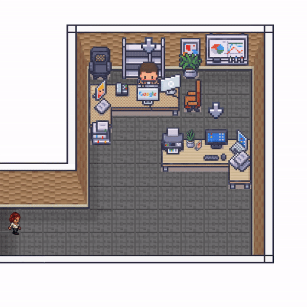 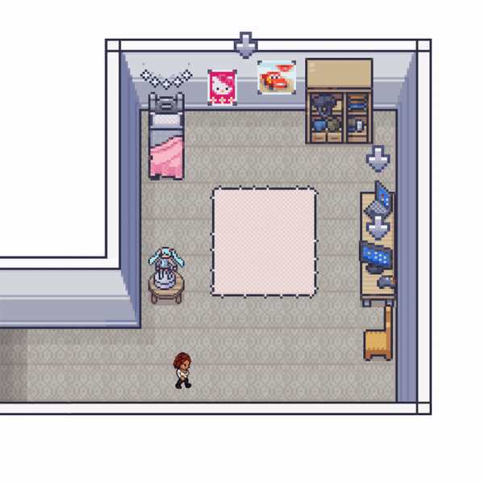 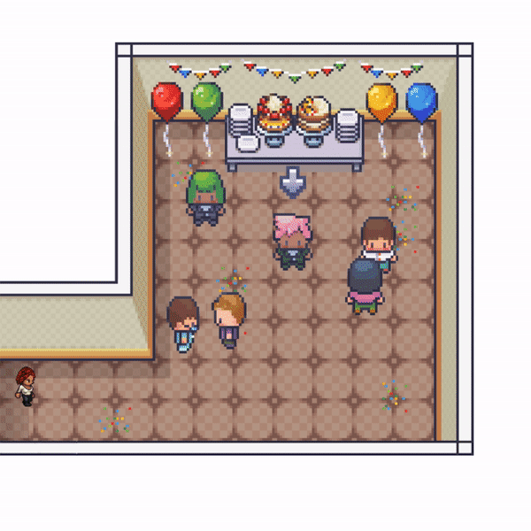   

##### Known Bugs  
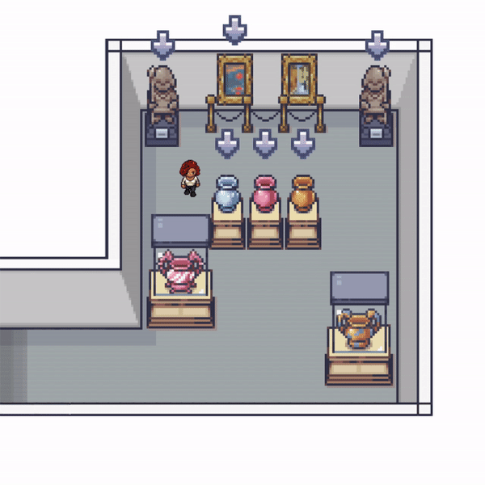 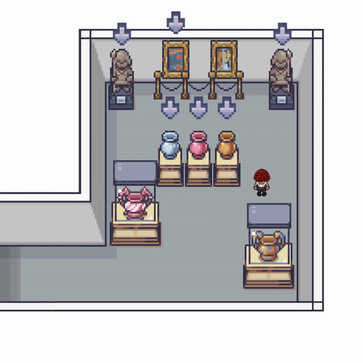
